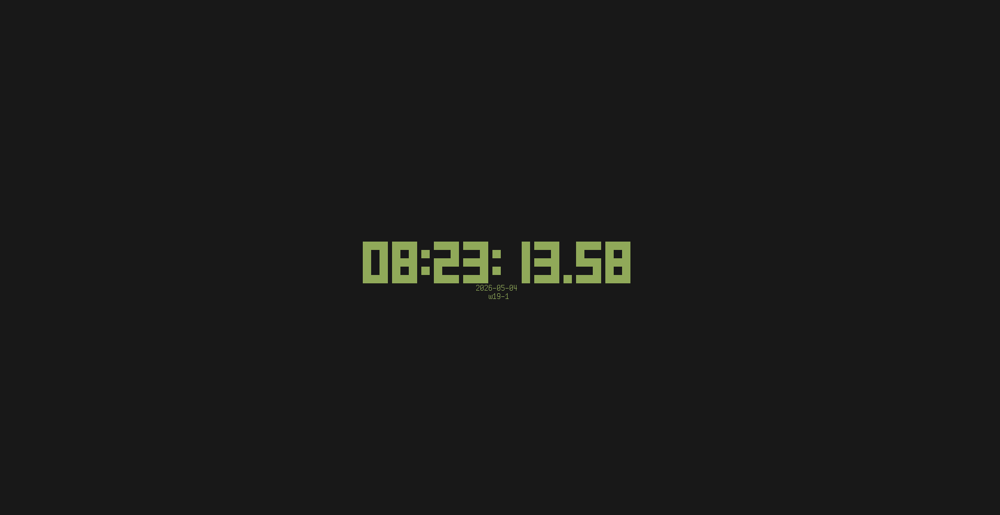

# fedik

fedik is a TUI Clock inspired by `tty-clock` written in Rust.



## Features

- Display the current time in a terminal interface
- Show seconds, milliseconds, date, and ISO week information
- Display local time or UTC
- Optional centered and bold display

## Usage

```bash
fedik --help
fedik -swd
```

### Controls

- Press `q`, `Esc`, or `Ctrl-C` to quit.

### Options

- `-s, --show-seconds`
- `-m, --ms-digits <1|2|3>`
- `-d, --show-date`
- `-w, --show-week`
- `-c, --center`
- `-u, --utc`
- `-b, --bold`

### Not implemented yet

- `--hour-12`
- `-f, --format`

## Installation

```bash
cargo install --path .
```
